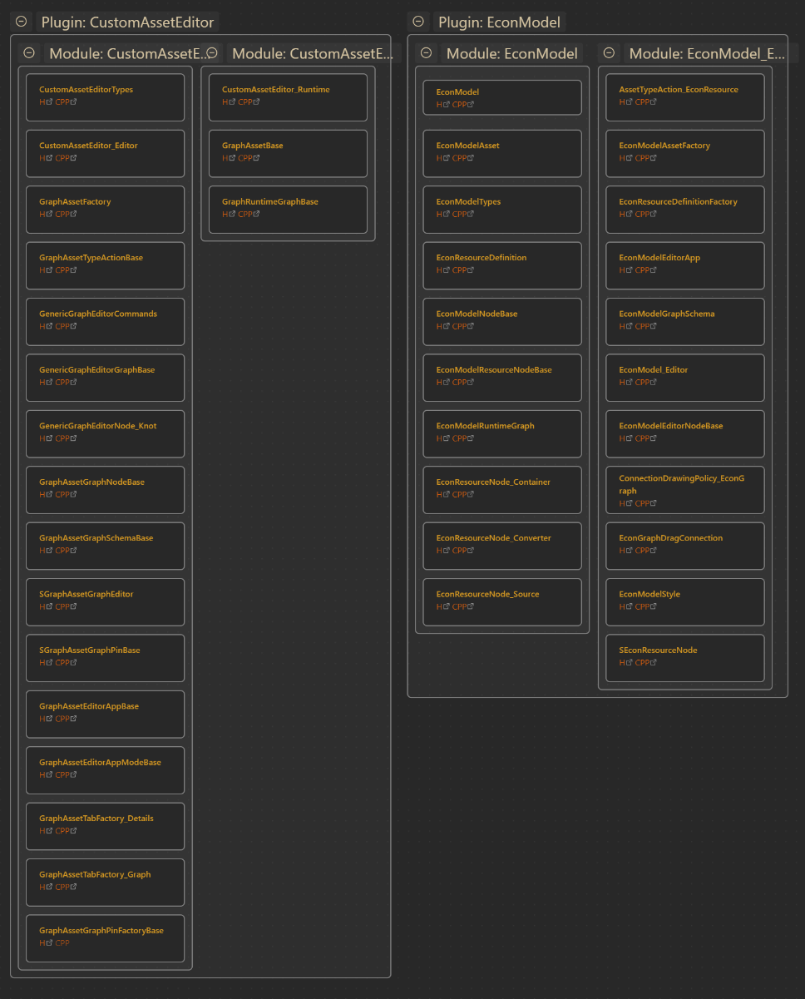

A simple script to produce JSON Canvases for Obsidian based on an unreal project.

Re-running the script on a pre-existing canvas will do its best to append new nodes below modules, while also updating links without changing other text. So you can move nodes around and update what they're called and the script should maintain all that.

Usage:
  -d, --directory   Root project directory to scan.                     [string] [default:Current Directory]

  -n, --name        Project name                                        [string]

  -e, --extensions  File extensions to include                          [array] [default: [".h",".hpp",".cpp"]]
  -o, --output      Output file (JSON format)                           [string]
  -m, --modules     Modules to include by name. 
                    For modules in plugins, do [pluginName]/[moduleName]. 
                    For modules in project root, do Root/[moduleName].
                    For all modules, do [pluginName]/*
                                                                        [array] [default: ["Root:*"]]
  -v, --verbose     Verbose output                                      [boolean]
      --ide         Which IDE to format the link for opening the files. 
                    Options: [rider, vscode, raw]
                                                                        [string] [default: "rider"]
      --version     Show version number                                 [boolean]
      --help        Show help                                           [boolean]

Example:
`node index.js -n MyProject -d "C:\Unreal\MyProject" -m Root\* -m SomePlugin/SomePluginEditor -m SomePlugin/SomePluginRuntime -o "C:\obsidianvault\My Project Classes.canvas"`
This will produce an Obsidian canvas for an unreal project called `MyProject`, and it will include all modules of `MyProject` as well as the Editor and Runtime modules of the project's `SomePlugin` plugin

